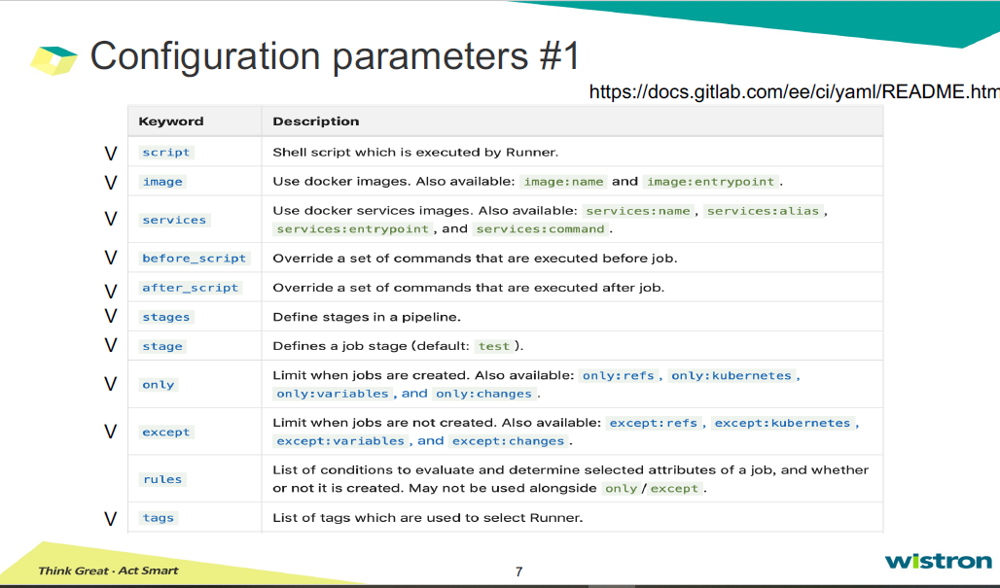
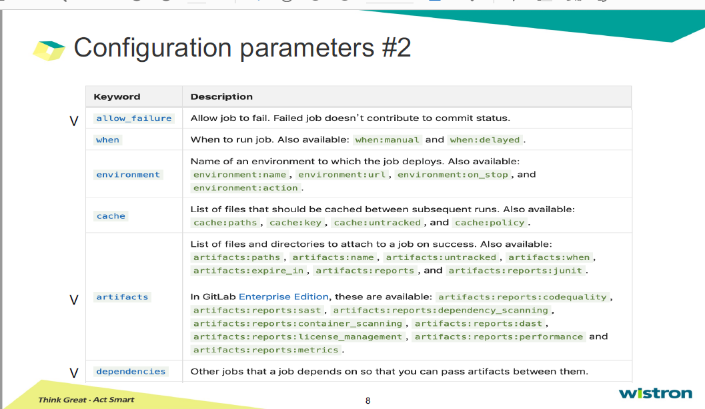
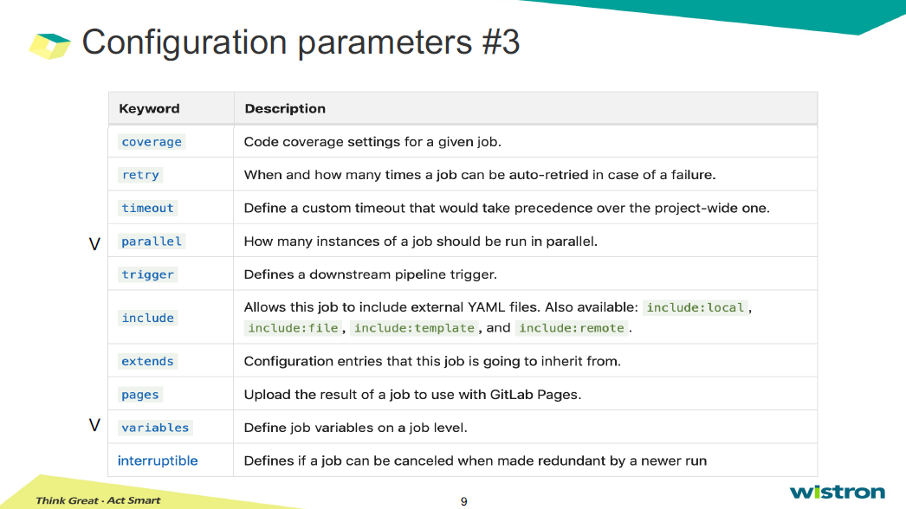

## How to write GitLab CI?
Pipelines comprise

### 保留字，不可作為JOB NAME
* image  
* services  
* stages  
* types  
* before_script  
* after_script  
* variables  
* cache  

    
  
  

* image & service: use for job  
* stages & stage & job : to define the stage of pipeline  
* before_script & after_script: the command before and after job  
* script: often be shell script, 執行在runner上  
* only & except: 限制執行的branch, 對於deploy尤其重要。  
* tag: 設定執行的runner名稱
* artifacts: attach to specfic file or directry on some job  
  - *artifacts:paths*  #要加那些特定檔案或目錄在job上
  - artifacts:when  :on_success, on_failure, always
  - artifacts:expire_in

# Lab1: 
* create .gitlab-ci.yml file
* hand to repository
* check GitLab pipeline

