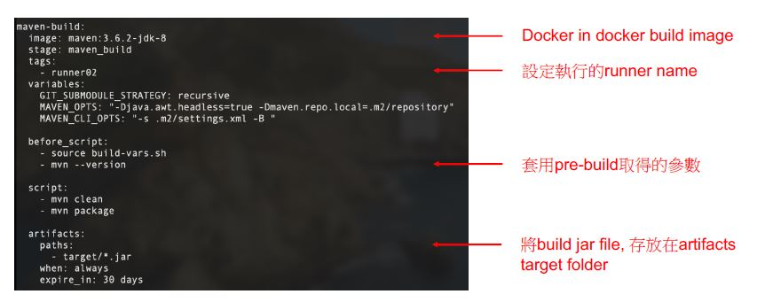

## How to write GitLab CI?
Pipelines comprise

### 保留字，不可作為JOB NAME
* image  
* services  
* stages  
* types  
* before_script  
* after_script  
* variables  
* cache  


    
  
  


* image & service: use for job  
* stages & stage & job : to define the stage of pipeline  
* before_script & after_script: the command before and after job  
* script: often be shell script, 執行在runner上  
* only & except: 限制執行的branch, 對於deploy尤其重要。  
* tag: 設定執行的runner名稱
* artifacts: attach to specfic file or directry on some job  
  - *artifacts:paths*  #要加那些特定檔案或目錄在job上
  - artifacts:when  :on_success, on_failure, always
  - artifacts:expire_in


# Lab1: 
* create .gitlab-ci.yml file
* hand to repository
* check GitLab pipeline ( CICD > pipelines )

# Lab2
* create gitlab-ci.yml
  - create the info of project: project name, version  
  - produce: image name, image tag  


* use Marven build jar file
* use Docker build docker image
* Push image file to harbor

```bash
# expand CICD > variables
# add HARBOR_USER/ HARBOR_PASSWORD

# Edit “gitlab-ci.yml”, change harbor directory
docker tag ${DOCKER_IMAGE_NAME}:${DOCKER_IMAGE_TAG} harbork8s.
wistron.com/cicd-demo/
10503120/${DOCKER_IMAGE_NAME}:${DOCKER_IMAGE_TAG}
docker push harbor-k8s.wistron.com/cicd-demo/
10503120/${DOCKER_IMAGE_NAME}:${DOCKER_IMAGE_TAG}

# Follow beloe command
git add .
git commit -m "change gitlab-ci.yml"
git push
```
* check CICD>pipeline: click "running" job
* check pipeline status  
* check Harbor about image upload


