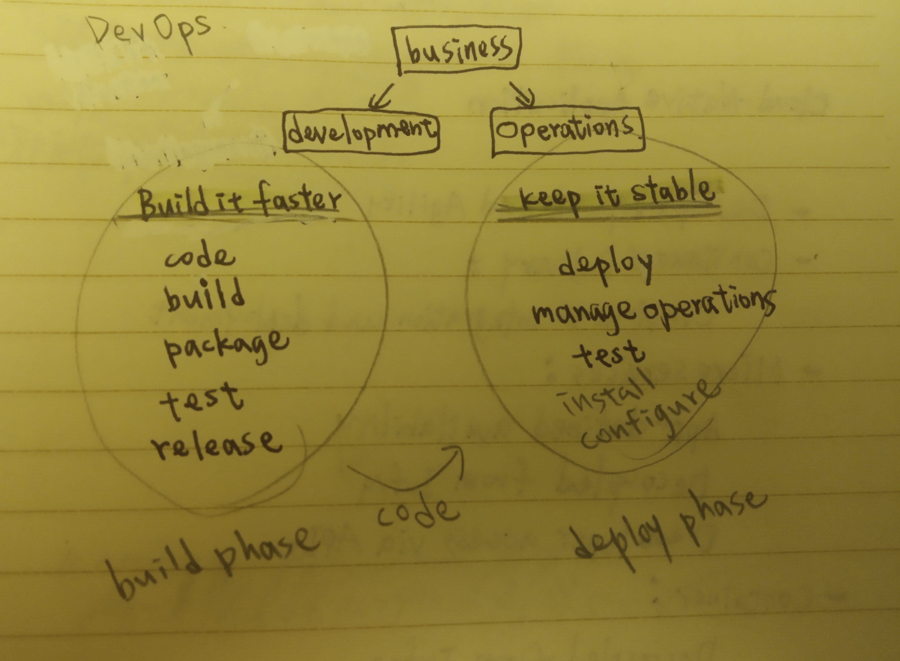
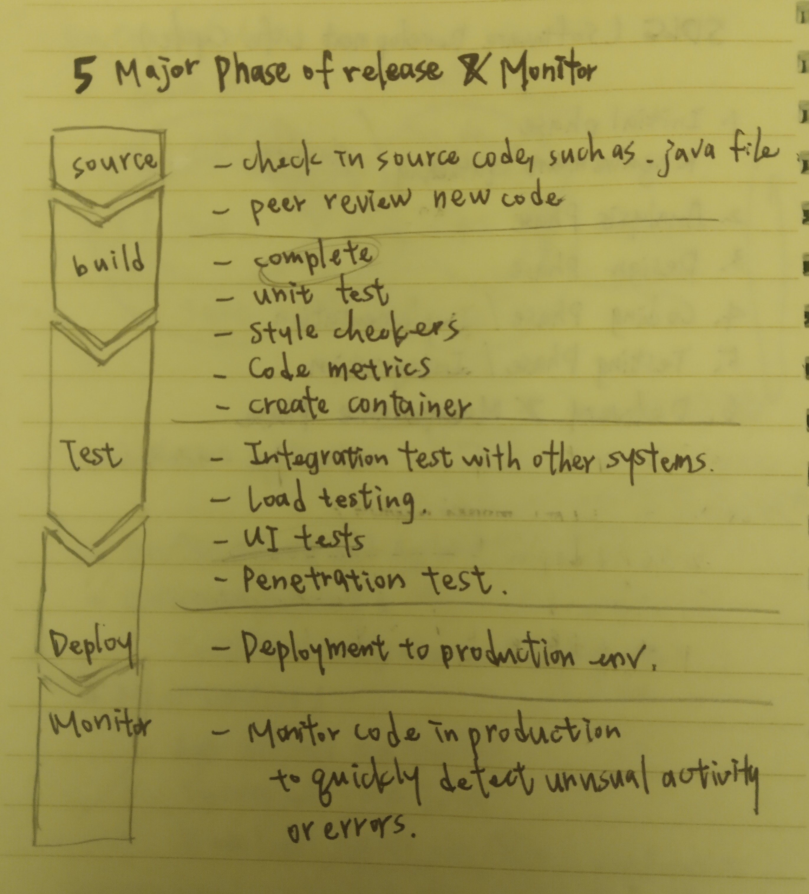
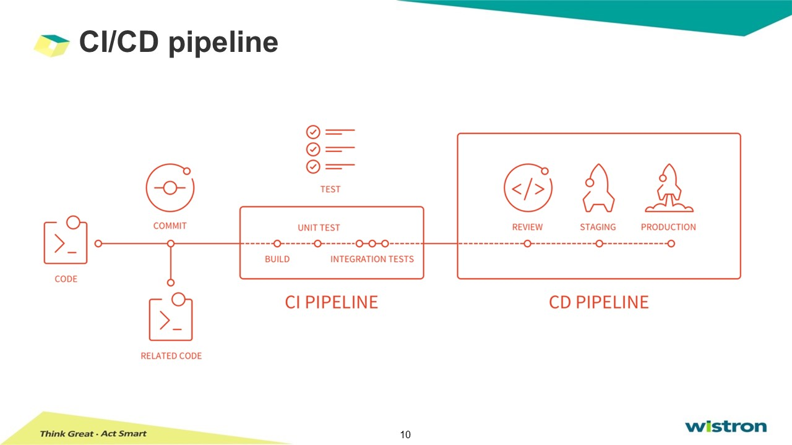
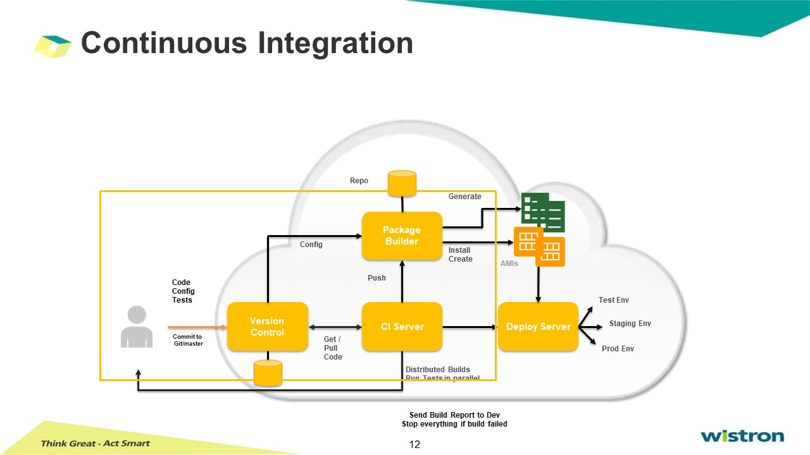
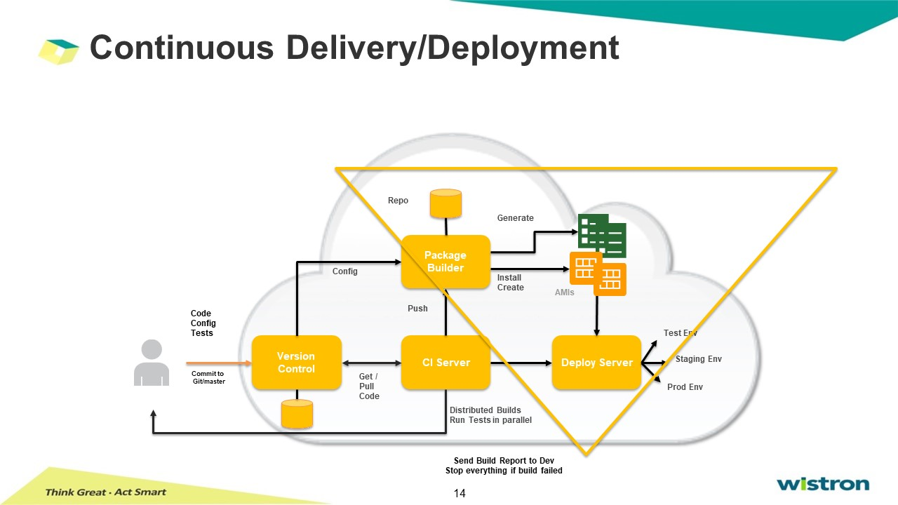
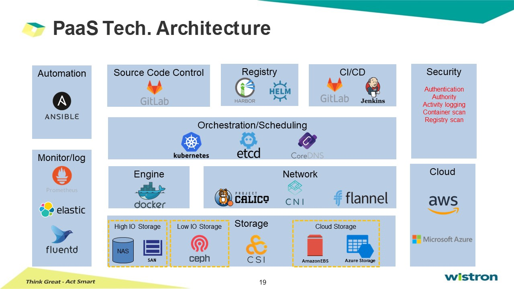
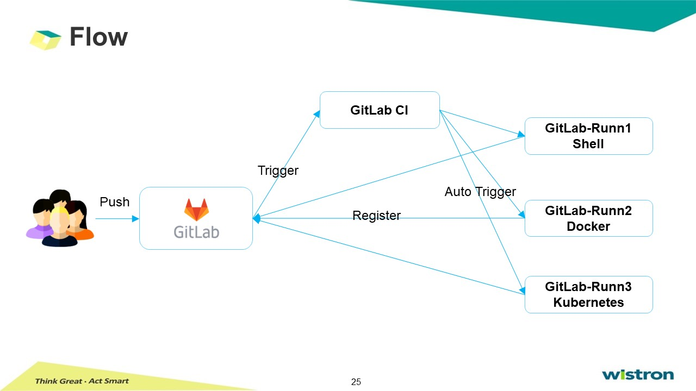

# GitLab CI and Runner

Q. 如何透過GitLab做CICD，將其作為container image，上傳至harbor? 

## Introdution of CI/CD  




## Cloud-Native Application  

* DevOps: speed and agility  
* Continuous Delivery: continuous integration and deployment  
* Micro services:  
  * App-defined availability  
  * Decoupled from Infra  
  * Developer access via APIs  
* Container: decoupled from Infra  

## SDLC- Software Development Life Cycle  
1. Initial phase: requirement gathering, planning  
2. Analysis phase
3. Design phase  
4. Coding phase: implementation  
5. Testing phase: integration
6. Delivery & Maintenance phase  




可全自動，也可部分自動部分手動，也可全自動
eg. WZS-AOI, AI model deploy, 最後的deploy是用手動模式，有人將model做成container check in harbor，再透過線邊人員直接部署於target system。




* Merging all developer working copies  
* Prevent integration problems (integration hell)  
  * Catch issue early  
* Build servers  
  * Automatically ran unit tests  
  * Reported the results to the developers  


* Continual delivery of code to an environment
  * Stage / UAT / Prod
* More incremental updates
  * Releasing software faster and more frequently
* Continual review and inspection
  * Logs & Monitoring



>>   
>>  
>>    



## How to use GitLab CI?  

> 在source code project下，建立.gitlab-ci.yml，可將所有行為intergration, test... 寫在yaml檔裡，當source code push到GitLab時，便會自動trigger出GitLab CI，執行此script。

## What is GitLab-Runner?  

> GitLab-Runner 是配合 GitLab CI 使用，GitLab 裡每個Repository都會定義自己的CI Script。  
Script: Stage, job, 例如build、compile、test、deploy..etc。  
當Repository有程式碼更新時，便會觸發 GitLab CI，找註冊好的Runner執行。  


## Install GitLab-Runner   
1. setting > CI/CD
2. install【gitlab-runner.exe】,【wistron-root.crt】

```bash
#Register GitLab-Runner
gitlab-runner register --tls-ca-file /Users/TMCHANG/cicd/wistron-root.crt

# enter URL: ...
# enter tooken: ...
# enter description: zhs-190201329
# enter gitlab-ci tag: tmrunner
# enter executor: docker
# enter default docker image: alpine:latest

cd gitlab-runner  
vi vonfig.toml  
```

