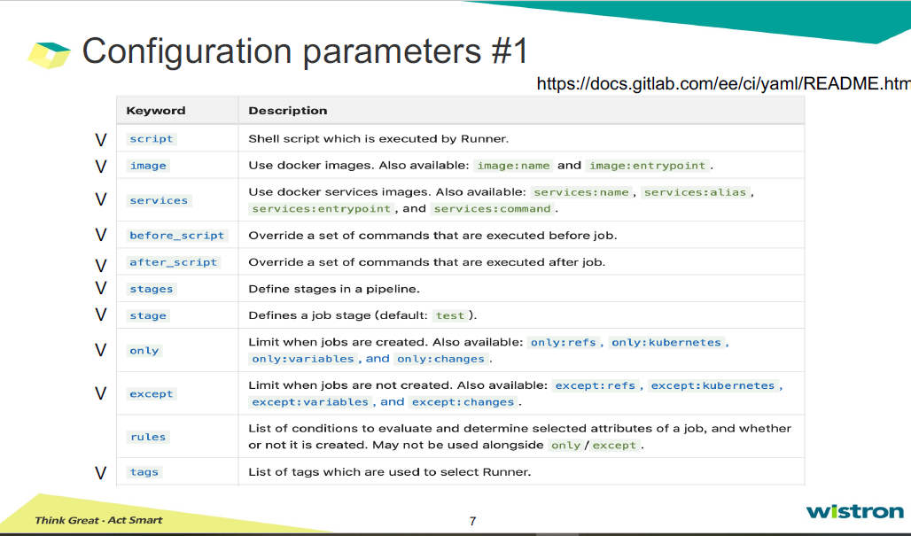

# GitLab CI and Runner

Q. 如何透過GitLab做CICD，將其作為container image，上傳至harbor? 

## Introdution of CI/CD  

## Cloud-Native Application  

* DevOps: speed and agility  
* Continuous Delivery: continuous integration and deployment  
* Micro services:  
  * app-defined availability  
  * Decoupled from Infra  
  * Developer access via APIs  
* Container: decoupled from Infra  

## SDLC- Software Development Life Cycle  
1. Initial phase: requirement gathering, planning  
2. Analysis phase
3. Design phase  
4. Coding phase: implementation  
5. Testing phase: integration
6. Delivery & Maintenance phase  

## How to write GitLab CI?
Pipelines comprise

### 保留字，不可作為JOB NAME
* image  
* services  
* stages  
* types  
* before_script  
* after_script  
* variables  
* cache  

  
  
  

* image & service: use for job  
* stages & stage & job : to define the stage of pipeline  
* before_script & after_script: the command before and after job  
* script: often be shell script, 執行在runner上  
* only & except: 限制執行的branch, 對於deploy尤其重要。  
* tag: 設定執行的runner名稱
* artifacts: attach to specfic file or directry on some job  
  - artifacts:paths  
  - artifacts:when  :on_success, on_failure, always
  - artifacts:expire_in

