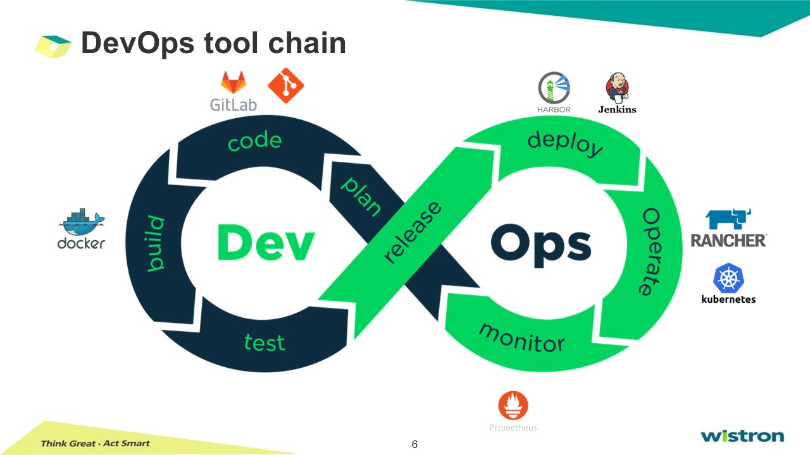

# GitLab CI and Runner

Q. 如何透過GitLab做CICD，將其作為container image，上傳至harbor? 

## Introdution of CI/CD  

## Cloud-Native Application  

* DevOps: speed and agility  
* Continuous Delivery: continuous integration and deployment  
* Micro services:  
  * app-defined availability  
  * Decoupled from Infra  
  * Developer access via APIs  
* Container: decoupled from Infra  

## SDLC- Software Development Life Cycle  
1. Initial phase: requirement gathering, planning  
2. Analysis phase
3. Design phase  
4. Coding phase: implementation  
5. Testing phase: integration
6. Delivery & Maintenance phase  

