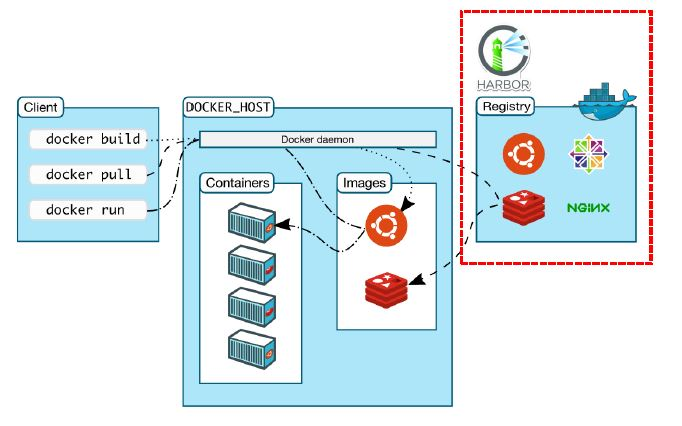

# 微服務/API: gRPC 轉換成REST API	

1. Docker映像檔的存儲庫-Harbor  
* Docker映像檔的存庫  
* 為什麼要建立企業私有的Docker存儲庫  
* Harbor的權限管理  
* Docker映像檔的push與pull練習  
2. gRPC的JSON Transcode (REST介面)  
* 什麼是gRPC JSON Transcode  
* gRPC JSON Transcode的應用場景  
* 什麼是Web Proxy, 為什麼要用Envoy?  
* 如何設置Envoy來對gRPC服務進行JSON Transcode  
* gRPC JSON Transcode實作練習 

# Docker Registry: Harbor
  


harbor: a public or cloud based registry  
A project in Harbor contains all repositories of an application.  

```
docker login harbor-k8s.wistron.com

# Let’s pull a image from docker.hub as sample  
docker pull hello-world
docker image ls

# Let’s retag a image  
docker tag hello-world harbor-k8s.wistron.com/{PRPJECT}/hello world  

# Pushing images  
docker push harbor-k8s.wistron.com/{PRPJECT}/hello-world
# Pulling images  
docker pull harbor-k8s.wistron.com/{ PRPJECT}/hello-world

```


